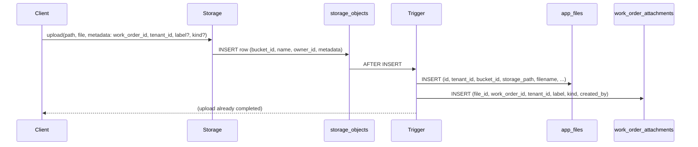

# Secure File Attachments: app.files as Single Source of Truth + Trigger

## Design principle

**app.files** is the single source of truth for all files in the CMMS. Work order attachments (and future asset/location attachments) reference `app.files` via `file_id`. When a file is uploaded to Storage, a trigger creates the file record in `app.files` first, then the attachment/link record (e.g. `app.work_order_attachments`).

## Data flow

## Schema

### app.files (new table — single source of truth for all CMMS files)

- `id` uuid PK default gen_random_uuid()
- `tenant_id` uuid not null references app.tenants
- `bucket_id` text not null (e.g. `'attachments'`)
- `storage_path` text not null (object path/name in bucket)
- `filename` text (from path or metadata)
- `content_type` text (from metadata or null)
- `byte_size` bigint (from metadata or null)
- `created_at` timestamptz default now()
- RLS: tenant-scoped; future reuse for assets, locations, etc.

### app.work_order_attachments (existing table — link work orders to files)

- **Replace** `file_ref` with `**file_id**` uuid not null references app.files(id)
- Keep: tenant_id, work_order_id, label, kind, created_by, created_at, updated_at
- One row per “this work order has this file as an attachment”; the file itself lives in app.files

## Upload flow (SDK)

1. **Client uploads:** `storage.from('attachments').upload(path, file, { metadata: { work_order_id, tenant_id, label?, kind? } })` with path e.g. `{tenant_id}/{work_order_id}/{uuid}_{filename}` (path must include tenant_id and work_order_id for RLS and trigger fallback).
2. **Storage API** inserts a row into `storage.objects` (bucket_id, name, owner_id, metadata if supported).
3. **Trigger** `AFTER INSERT` on `storage.objects` for bucket `attachments`:
  - Validate uploader can edit the work order (e.g. `authz.can_read_work_order(work_order_id)` from metadata or path).
  - **Insert into app.files:** id = gen_random_uuid(), tenant_id, bucket_id = NEW.bucket_id, storage_path = NEW.name, filename = storage.filename(NEW.name), content_type = NEW.metadata->>'content_type', byte_size = (NEW.metadata->>'byte_size')::bigint, created_at = now(). Tenant_id and work_order_id from NEW.metadata or from path segments `(storage.foldername(NEW.name))[1]`, `[2]`.
  - **Insert into app.work_order_attachments:** file_id = (the new app.files.id), tenant_id, work_order_id, label = NEW.metadata->>'label', kind = NEW.metadata->>'kind', created_by = NEW.owner_id.
4. No RPC to create the attachment — trigger handles it.

**Fallback if upload API does not accept custom metadata:** Encode tenant_id and work_order_id in the path (e.g. `{tenant_id}/{work_order_id}/{filename}`); trigger derives them from `(storage.foldername(NEW.name))[1]`, `[2]`. Label/kind can be null or set by client PATCH after upload.

## Trigger function (conceptual)

- Name: e.g. `app.on_attachment_object_inserted()`.
- Runs: `AFTER INSERT` on `storage.objects` when `NEW.bucket_id = 'attachments'`.
- Steps: (1) Parse tenant_id, work_order_id from NEW.metadata or path. (2) Validate `authz.can_read_work_order(work_order_id)`. (3) Insert into app.files, returning id. (4) Insert into app.work_order_attachments with that file_id, plus label, kind, created_by from metadata/owner_id.

## RLS on storage.objects

- **SELECT:** Allow when (bucket_id, name) matches an app.files row that is linked to a work order the user can read: `exists (select 1 from app.files f join app.work_order_attachments woa on woa.file_id = f.id join app.work_orders wo on wo.id = woa.work_order_id where f.bucket_id = storage.objects.bucket_id and f.storage_path = storage.objects.name and authz.is_current_user_tenant_member(wo.tenant_id))`. Later use `authz.can_read_work_order(wo.id)` when department scoping is added.
- **INSERT:** Allow when path/metadata correspond to a work order the user can edit (same work-order access check).
- **UPDATE/DELETE:** Allow when the object is linked via app.files to an attachment on a work order the user can update/delete.

## View and client URL flow

- **v_work_order_attachments:** Join `app.work_order_attachments` → `app.files`; expose id, work_order_id, label, kind, created_by, created_at, **bucket_id**, **storage_path** (and optionally filename, content_type) from app.files. No permanent file_url; client uses bucket_id + storage_path for `createSignedUrl(bucket_id, storage_path, 3600)`.

## Migration steps (edit existing migrations only)

1. **New migration:** Create **app.files** table (id, tenant_id, bucket_id, storage_path, filename, content_type, byte_size, created_at); RLS and indexes. Add **file_id** to app.work_order_attachments (references app.files); drop **file_ref**.
2. **New migration:** Create **private** bucket `attachments`. Add **trigger** `AFTER INSERT` on `storage.objects` for bucket `attachments` calling `app.on_attachment_object_inserted()` (insert app.files then app.work_order_attachments; validate work order access).
3. **New migration:** Add **RLS on storage.objects** for SELECT (and INSERT/UPDATE/DELETE) tied to work order access via app.files → work_order_attachments → work_orders.
4. **Edit view:** Update [v_work_order_attachments](supabase/migrations/20260202170132_07_public_api.sql) to join app.work_order_attachments → app.files and expose bucket_id, storage_path (and filename, content_type). Update INSTEAD OF triggers to use file_id (and update app.files or work_order_attachments as needed).
5. **RPC:** Remove or repurpose `rpc_add_work_order_attachment` — create is handled by upload + trigger; optional RPC only to update label/kind after upload.
6. Document client flow: upload with metadata → trigger creates app.files + work_order_attachments row; query view → createSignedUrl(bucket_id, storage_path, 3600) per row.

No backfilling; schema and migrations only.

## Summary

| Aspect                 | Approach                                                                                                                  |
| ---------------------- | ------------------------------------------------------------------------------------------------------------------------- |
| Single source of truth | **app.files** for all CMMS files; work_order_attachments links work orders to files via file_id.                          |
| Upload                 | Client uploads with metadata (work_order_id, tenant_id, label?, kind?); path includes tenant_id and work_order_id.        |
| Trigger                | AFTER INSERT on storage.objects: insert app.files first, then app.work_order_attachments with file_id.                    |
| RLS                    | storage.objects access via app.files → work_order_attachments → work_orders (work order access).                          |
| View                   | v_work_order_attachments joins work_order_attachments → app.files; exposes bucket_id, storage_path for createSignedUrl(). |

