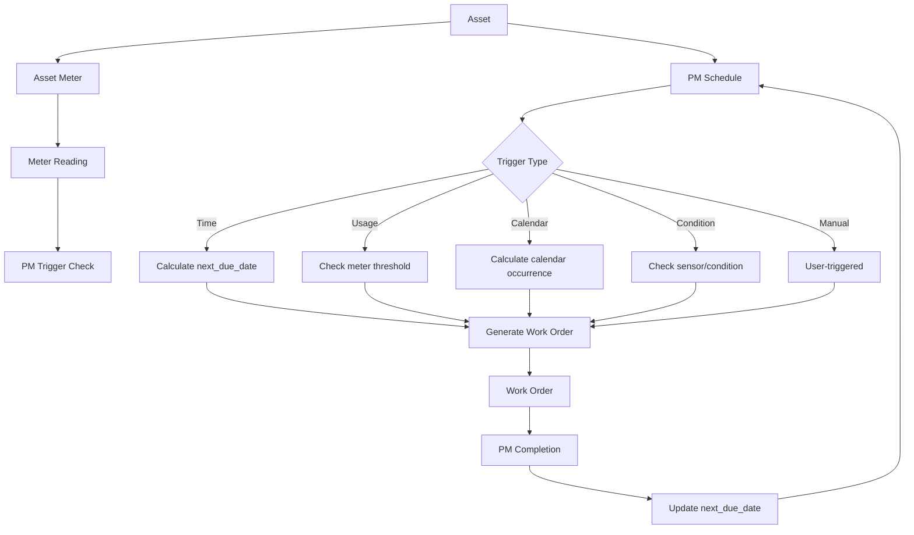

# Complete Meters and Preventive Maintenance System

## Overview

This plan implements a comprehensive meter tracking system and flexible preventive maintenance (PM) scheduling system. The meter system supports multiple meter types per asset with full reading history. The PM system supports five trigger types: time-based, usage-based, calendar-based, condition-based, and manual, with full integration between meters and PM schedules.

## Architecture

### System Flow



## Part 1: Meter System

### Tables

#### `app.asset_meters`

Meter definitions attached to assets. Supports multiple meters per asset.

**Schema:**

- `id` uuid (primary key)
- `tenant_id` uuid (references `app.tenants`, cascade delete)
- `asset_id` uuid (references `app.assets`, cascade delete)
- `meter_type` text (check: 'runtime_hours', 'cycles', 'miles', 'production_units', 'custom')
- `name` text (1-255 chars, display name)
- `unit` text (1-50 chars, e.g., 'hours', 'miles', 'count')
- `current_reading` numeric (default 0, >= 0)
- `last_reading_date` timestamptz
- `reading_direction` text (check: 'increasing', 'decreasing', 'reset', default 'increasing')
- `decimal_places` integer (0-6, default 0)
- `is_active` boolean (default true)
- `description` text
- `installation_date` date
- `created_at`, `updated_at` timestamptz

**Indexes:**

- `asset_meters_tenant_asset_idx` on (tenant_id, asset_id)
- `asset_meters_active_idx` on (tenant_id, asset_id, is_active) where is_active = true
- `asset_meters_type_idx` on (meter_type) for PM queries

**Constraints:**

- Unique: (tenant_id, asset_id, name) - prevent duplicate meter names per asset
- Check: meter_type in allowed values
- Check: reading_direction in allowed values
- Check: decimal_places 0-6
- Check: current_reading >= 0

#### `app.meter_readings`

Full audit trail of all meter readings.

**Schema:**

- `id` uuid (primary key)
- `tenant_id` uuid (references `app.tenants`, cascade delete)
- `meter_id` uuid (references `app.asset_meters`, cascade delete)
- `reading_value` numeric (>= 0)
- `reading_date` timestamptz (not null, when reading was taken)
- `reading_type` text (check: 'manual', 'automated', 'imported', 'estimated', default 'manual')
- `notes` text
- `recorded_by` uuid (references `auth.users`, set null on delete)
- `created_at` timestamptz

**Indexes:**

- `meter_readings_meter_date_idx` on (meter_id, reading_date desc) for history queries
- `meter_readings_tenant_date_idx` on (tenant_id, reading_date desc) for tenant-wide queries
- `meter_readings_meter_covering_idx` on (meter_id) include (reading_value, reading_date, reading_type)

**Constraints:**

- Check: reading_type in allowed values
- Check: reading_value >= 0

### Validation Functions

#### `util.validate_meter_reading()`

Trigger function that validates new meter readings:

- Ensures reading_value >= 0
- For increasing meters: warns if new reading < current (allows with tolerance for user error)
- For decreasing meters: validates appropriately
- For reset meters: always allows
- Updates `app.asset_meters.current_reading` and `last_reading_date` on insert

#### `util.validate_asset_meter_tenant()`

Trigger function ensuring meter belongs to same tenant as asset.

### RPC Functions

**Note:** All RPC functions are created in the API layer migration (`YYYYMMDDHHmmss_add_meters_and_pm_api_layer.sql`), not in the tables migration.

#### `public.rpc_create_meter(p_tenant_id, p_asset_id, p_meter_type, p_name, p_unit, p_current_reading, p_reading_direction, p_decimal_places, p_description)`

Creates new meter for asset. Validates asset belongs to tenant, meter_type is valid, name is unique per asset. Requires `asset.edit` permission.

#### `public.rpc_update_meter(p_tenant_id, p_meter_id, p_name, p_unit, p_reading_direction, p_decimal_places, p_description, p_is_active)`

Updates meter configuration. Cannot change meter_type or current_reading (use record_reading for that). Requires `asset.edit` permission.

#### `public.rpc_record_meter_reading(p_tenant_id, p_meter_id, p_reading_value, p_reading_date, p_reading_type, p_notes)`

Records new meter reading. Validates reading, updates meter current_reading, creates reading history record, triggers PM usage-based checks. Requires `asset.edit` permission.

#### `public.rpc_delete_meter(p_tenant_id, p_meter_id)`

Soft deletes meter (sets is_active = false). Validates no active PM schedules reference this meter. Requires `asset.edit` permission.

### Views

#### `public.v_asset_meters`

Current active meters for assets in current tenant context. Includes asset name, meter details, current reading, last reading date.

#### `public.v_meter_readings`

Reading history for meters in current tenant context. Includes meter name, asset name, reading details, recorded by user.

## Part 2: PM System

### Tables

#### `cfg.pm_templates`

Reusable PM procedure templates.

**Schema:**

- `id` uuid (primary key)
- `tenant_id` uuid (references `app.tenants`, cascade delete)
- `name` text (1-255 chars)
- `description` text
- `trigger_type` text (check: 'time', 'usage', 'calendar', 'condition', 'manual')
- `trigger_config` jsonb (not null, validated per trigger type)
- `work_order_template` jsonb (default WO fields: title, description, priority, estimated_hours, checklist)
- `checklist` jsonb (array of step objects with description, required)
- `estimated_hours` numeric
- `is_system` boolean (default false)
- `created_at`, `updated_at` timestamptz

**Indexes:**

- `pm_templates_tenant_idx` on (tenant_id, is_system)
- `pm_templates_trigger_type_idx` on (trigger_type) for filtering

#### `app.pm_schedules`

PM schedule definitions attached to assets.

**Schema:**

- `id` uuid (primary key)
- `tenant_id` uuid (references `app.tenants`, cascade delete)
- `asset_id` uuid (references `app.assets`, cascade delete, nullable for future multi-asset PMs)
- `template_id` uuid (references `cfg.pm_templates`, nullable)
- `title` text (1-500 chars, not null)
- `description` text
- `trigger_type` text (check: 'time', 'usage', 'calendar', 'condition', 'manual', not null)
- `trigger_config` jsonb (not null, validated per trigger type)
- `work_order_template` jsonb (overrides template, default WO fields)
- `auto_generate` boolean (default true)
- `next_due_date` timestamptz (computed, denormalized for performance)
- `last_completed_at` timestamptz
- `last_work_order_id` uuid (references `app.work_orders`)
- `completion_count` integer (default 0)
- `parent_pm_id` uuid (references `app.pm_schedules`, for dependencies)
- `is_active` boolean (default true)
- `created_at`, `updated_at` timestamptz

**Indexes:**

- `pm_schedules_tenant_asset_idx` on (tenant_id, asset_id, is_active)
- `pm_schedules_due_idx` on (tenant_id, next_due_date, is_active) where is_active = true and auto_generate = true
- `pm_schedules_trigger_type_idx` on (trigger_type) for trigger evaluation
- `pm_schedules_template_idx` on (template_id) where template_id is not null

**Constraints:**

- Check: trigger_type in allowed values
- Check: trigger_config is valid JSONB (validated in RPC)
- Unique: (tenant_id, asset_id, title) - prevent duplicate PM names per asset

#### `app.pm_history`

Complete audit trail of PM executions.

**Schema:**

- `id` uuid (primary key)
- `tenant_id` uuid (references `app.tenants`, cascade delete)
- `pm_schedule_id` uuid (references `app.pm_schedules`, cascade delete)
- `work_order_id` uuid (references `app.work_orders`, set null on delete)
- `scheduled_date` timestamptz (when PM was due)
- `completed_date` timestamptz (when WO was completed)
- `completed_by` uuid (references `auth.users`, set null on delete)
- `actual_hours` numeric
- `cost` numeric
- `notes` text
- `created_at` timestamptz

**Indexes:**

- `pm_history_pm_idx` on (pm_schedule_id, scheduled_date desc)
- `pm_history_work_order_idx` on (work_order_id) where work_order_id is not null
- `pm_history_tenant_date_idx` on (tenant_id, scheduled_date desc)

#### `app.pm_dependencies`

PM dependency relationships (PM B must run after PM A).

**Schema:**

- `id` uuid (primary key)
- `tenant_id` uuid (references `app.tenants`, cascade delete)
- `pm_schedule_id` uuid (references `app.pm_schedules`, cascade delete)
- `depends_on_pm_id` uuid (references `app.pm_schedules`, cascade delete)
- `dependency_type` text (check: 'before', 'after', 'same_day', default 'after')
- `created_at` timestamptz

**Indexes:**

- `pm_dependencies_pm_idx` on (pm_schedule_id)
- `pm_dependencies_depends_on_idx` on (depends_on_pm_id)
- Unique: (pm_schedule_id, depends_on_pm_id) - prevent duplicate dependencies

**Constraints:**

- Check: dependency_type in allowed values
- Prevent circular dependencies (validated in RPC)

### Trigger Configuration Schemas

#### Time-based (`trigger_type = 'time'`)

```json
{
  "interval_days": 90,
  "start_date": "2024-01-01T00:00:00Z",
  "timezone": "UTC"
}
```

Required: `interval_days` (integer >= 1)

Optional: `start_date` (ISO timestamp), `timezone` (IANA timezone, default UTC)

#### Usage-based (`trigger_type = 'usage'`)

```json
{
  "meter_id": "uuid",
  "threshold": 5000,
  "reset_after_pm": false,
  "threshold_offset": 0
}
```

Required: `meter_id` (uuid), `threshold` (numeric > 0)

Optional: `reset_after_pm` (boolean, default false), `threshold_offset` (numeric, default 0)

#### Calendar-based (`trigger_type = 'calendar'`)

```json
{
  "pattern": "monthly",
  "day_of_month": 1,
  "day_of_week": "monday",
  "week_of_month": 1,
  "months": [1,2,3,4,5,6,7,8,9,10,11],
  "timezone": "America/New_York",
  "business_days_only": true,
  "skip_holidays": false,
  "holiday_calendar_id": null
}
```

Required: `pattern` ('daily', 'weekly', 'monthly', 'quarterly', 'yearly')

Optional: day_of_month (1-31), day_of_week (monday-sunday), week_of_month (1-5), months (array 1-12), timezone, business_days_only, skip_holidays, holiday_calendar_id

#### Condition-based (`trigger_type = 'condition'`)

```json
{
  "sensor_id": "uuid",
  "threshold": 75,
  "operator": "greater_than",
  "integration_id": "uuid",
  "check_interval_minutes": 60
}
```

Required: `sensor_id` or `integration_id`, `threshold` (numeric), `operator` ('greater_than', 'less_than', 'equals', 'not_equals')

Optional: `check_interval_minutes` (integer >= 1)

#### Manual (`trigger_type = 'manual'`)

```json
{}
```

No configuration required. User triggers PM manually.

### Core Functions

#### `pm.calculate_next_due_date(p_pm_schedule app.pm_schedules, p_last_completed_at timestamptz)`

Calculates next_due_date based on trigger_type and trigger_config. Handles all trigger types, returns timestamptz or null.

#### `pm.validate_trigger_config(p_trigger_type text, p_trigger_config jsonb)`

Validates trigger_config structure matches trigger_type requirements. Raises exception with clear error message if invalid.

#### `pm.is_pm_due(p_pm_schedule app.pm_schedules)`

Checks if PM is currently due based on trigger_type. Returns boolean.

#### `pm.generate_pm_work_order(p_pm_schedule_id uuid)`

Generates work order from PM schedule. Uses work_order_template, sets maintenance_type to 'preventive_time' or 'preventive_usage', links to PM schedule, updates next_due_date.

#### `pm.check_pm_dependencies(p_pm_schedule_id uuid)`

Checks if PM dependencies are satisfied. Returns boolean indicating if PM can be generated.

#### `pm.update_pm_on_completion(p_work_order_id uuid)`

Called when PM work order is completed. Updates pm_schedules.last_completed_at, completion_count, recalculates next_due_date, creates pm_history record, handles usage meter reset if configured.

### Validation Functions

#### `util.validate_pm_trigger_config()`

Trigger function validating trigger_config on insert/update. Calls `pm.validate_trigger_config()`.

#### `util.validate_pm_meter_tenant()`

Trigger function ensuring usage-based PM meters belong to same tenant.

#### `util.validate_pm_dependency_cycle()`

Trigger function preventing circular PM dependencies. Uses recursive CTE to detect cycles.

### RPC Functions

**Note:** All RPC functions are created in the API layer migration (`YYYYMMDDHHmmss_add_meters_and_pm_api_layer.sql`), not in the tables migration.

#### `public.rpc_create_pm_template(p_tenant_id, p_name, p_description, p_trigger_type, p_trigger_config, p_work_order_template, p_checklist, p_estimated_hours)`

Creates reusable PM template. Validates trigger_config. Requires `tenant.admin` permission.

#### `public.rpc_update_pm_template(p_tenant_id, p_template_id, p_name, p_description, p_trigger_config, p_work_order_template, p_checklist, p_estimated_hours)`

Updates PM template. Validates trigger_config. Requires `tenant.admin` permission.

#### `public.rpc_create_pm_schedule(p_tenant_id, p_asset_id, p_title, p_description, p_trigger_type, p_trigger_config, p_template_id, p_work_order_template, p_auto_generate)`

Creates PM schedule for asset. Validates trigger_config, calculates initial next_due_date, validates meter exists for usage triggers. Requires `workorder.create` permission.

#### `public.rpc_update_pm_schedule(p_tenant_id, p_pm_schedule_id, p_title, p_description, p_trigger_config, p_work_order_template, p_auto_generate, p_is_active)`

Updates PM schedule. Recalculates next_due_date if trigger_config changes. Requires `workorder.create` permission.

#### `public.rpc_delete_pm_schedule(p_tenant_id, p_pm_schedule_id)`

Soft deletes PM schedule (sets is_active = false). Validates no active dependencies. Requires `workorder.create` permission.

#### `public.rpc_generate_due_pms(p_tenant_id, p_limit)`

Batch function to generate work orders for due PMs. Finds PMs where next_due_date <= now() and is_due() = true, checks dependencies, generates WOs, updates next_due_date. Returns count of generated WOs. Requires `workorder.create` permission.

#### `public.rpc_trigger_manual_pm(p_tenant_id, p_pm_schedule_id)`

Manually triggers a manual-type PM schedule. Generates work order immediately. Requires `workorder.create` permission.

#### `public.rpc_create_pm_dependency(p_tenant_id, p_pm_schedule_id, p_depends_on_pm_id, p_dependency_type)`

Creates PM dependency. Validates no circular dependencies. Requires `workorder.create` permission.

### Views

#### `public.v_pm_schedules`

PM schedules for current tenant. Includes asset name, trigger details, next_due_date, last_completed_at, completion_count, is_overdue flag.

#### `public.v_pm_templates`

PM templates for current tenant. Includes trigger_type, trigger_config summary.

#### `public.v_due_pms`

PMs that are currently due (next_due_date <= now() and is_due() = true). For dashboard display.

#### `public.v_overdue_pms`

PMs that are overdue (next_due_date < now() - interval '1 day'). For alerts.

#### `public.v_upcoming_pms`

PMs due in next 7/30 days. For planning.

#### `public.v_pm_history`

PM execution history for current tenant. Includes PM details, work order details, completion info.

## Part 3: Integration Points

### Meter Reading → PM Check

When `rpc_record_meter_reading` is called:

1. Update meter current_reading
2. Create meter_readings record
3. Find all usage-based PM schedules using this meter
4. For each PM: check if current_reading >= threshold
5. If due and auto_generate: call `pm.generate_pm_work_order()`
6. If reset_after_pm: update threshold offset

### PM Completion → Next Due Date

When PM work order is completed:

1. `pm.update_pm_on_completion()` is called (via trigger or RPC)
2. Update pm_schedules.last_completed_at
3. Recalculate next_due_date using `pm.calculate_next_due_date()`
4. Create pm_history record
5. If usage-based with reset_after_pm: update meter threshold

### Work Order Linkage

Add to `app.work_orders`:

- `pm_schedule_id` uuid (references `app.pm_schedules`, nullable, on delete set null)
- Index: `work_orders_pm_schedule_idx` on (pm_schedule_id) where pm_schedule_id is not null

**API Layer Integration:**

- The `pm.generate_pm_work_order()` function will call `public.rpc_create_work_order()` with the `p_pm_schedule_id` parameter
- The updated `rpc_create_work_order` function (in the API layer migration) will accept `p_pm_schedule_id` as an optional parameter
- When a work order is created from a PM schedule, the `pm_schedule_id` is automatically set
- The work order completion trigger will call `pm.update_pm_on_completion()` to update PM schedule state

## Part 4: Error Handling & Edge Cases

### Meter Reading Validation

- Decreasing readings for increasing meters: warn if > 10% decrease, allow if < 10% (user error tolerance)
- Future-dated readings: allow up to 7 days in future (for batch imports)
- Backdated readings: allow up to 90 days in past
- Missing readings: support 'estimated' reading_type

### PM Generation Errors

- Invalid trigger_config: log error, skip PM, alert admin
- Missing meter: log error, skip usage-based PM, alert admin
- Dependency not met: skip PM, log reason
- Work order creation failure: log error, retry mechanism

### Performance Optimizations

- Denormalize next_due_date for all trigger types (simple WHERE clause)
- Materialized view `mv_due_pms` refreshed every hour for dashboard
- Batch PM generation with limit (e.g., 100 PMs per batch)
- Index on (tenant_id, next_due_date, is_active) for due PM queries

## Part 5: Migration Strategy

### Migration Structure

The implementation will be split into multiple migration files to respect the existing migration structure and ensure proper ordering:

**Existing Migration Order:**

- `20260121120000_foundation.sql`
- `20260121121000_core_tables.sql`
- `20260121122000_authorization.sql`
- `20260121123000_workflows.sql`
- `20260121124000_api_layer.sql` (existing API layer - DO NOT MODIFY)
- `20260121125000_enterprise_features.sql`
- `20260121126000_security_hardening.sql`
- `20260121127000_add_technician_roles_labor_attachments.sql`
- `20260121128000_add_dashboard_views.sql`
- `20260121129000_add_maintenance_types.sql`

**New Migrations to Create:**

#### Migration 1: `YYYYMMDDHHmmss_add_meters_and_pm_tables.sql`

This migration creates all tables, functions, triggers, and core logic. Must be created after `20260121129000_add_maintenance_types.sql`.

**Order of operations:**

1. Create meter tables (app.asset_meters, app.meter_readings)
2. Create PM tables (cfg.pm_templates, app.pm_schedules, app.pm_history, app.pm_dependencies)
3. Add pm_schedule_id column to app.work_orders (with foreign key constraint)
4. Create validation functions (util.validate_meter_reading, util.validate_asset_meter_tenant, util.validate_pm_trigger_config, util.validate_pm_meter_tenant, util.validate_pm_dependency_cycle)
5. Create core PM functions in `pm` schema (calculate_next_due_date, validate_trigger_config, is_pm_due, generate_pm_work_order, check_pm_dependencies, update_pm_on_completion)
6. Create trigger functions
7. Create triggers
8. Create views (v_asset_meters, v_meter_readings, v_pm_schedules, v_pm_templates, v_due_pms, v_overdue_pms, v_upcoming_pms, v_pm_history)
9. Enable RLS policies
10. Grant permissions

#### Migration 2: `YYYYMMDDHHmmss_add_meters_and_pm_api_layer.sql`

This migration creates all RPC functions for meters and PM system. Must be created after the tables migration.

**Order of operations:**

1. Create meter RPC functions:

   - `public.rpc_create_meter`
   - `public.rpc_update_meter`
   - `public.rpc_record_meter_reading`
   - `public.rpc_delete_meter`

2. Create PM template RPC functions:

   - `public.rpc_create_pm_template`
   - `public.rpc_update_pm_template`

3. Create PM schedule RPC functions:

   - `public.rpc_create_pm_schedule`
   - `public.rpc_update_pm_schedule`
   - `public.rpc_delete_pm_schedule`
   - `public.rpc_generate_due_pms`
   - `public.rpc_trigger_manual_pm`
   - `public.rpc_create_pm_dependency`

4. Update existing work order RPC:

   - Extend `public.rpc_create_work_order` to accept `p_pm_schedule_id` parameter (using `create or replace function`)
   - New signature: `public.rpc_create_work_order(p_tenant_id, p_title, p_description, p_priority, p_assigned_to, p_location_id, p_asset_id, p_due_date, p_pm_schedule_id default null)`
   - Validates that `p_pm_schedule_id` belongs to the tenant and is active (if provided)
   - Sets `pm_schedule_id` on the work order when provided
   - Maintains backward compatibility: existing calls without `p_pm_schedule_id` continue to work
   - This extends the existing function signature without breaking backward compatibility

**Important Notes:**

- **DO NOT modify existing migration files** (`20260121124000_api_layer.sql`). Instead, use `create or replace function` in the new API layer migration to extend `rpc_create_work_order`.
- The new `rpc_create_work_order` signature will be backward compatible (p_pm_schedule_id will be optional with default null).
- All RPC functions follow the same security pattern as existing API layer functions (security definer, set search_path = '', rate limiting, permission checks).

**Backward compatibility:**

- All new tables, no changes to existing tables (except adding pm_schedule_id column to work_orders)
- Existing work orders continue to work (pm_schedule_id is nullable)
- Existing `rpc_create_work_order` calls continue to work (new parameter is optional)
- Existing assets continue to work

## Files to Create

### New Migration Files

1. `supabase/migrations/YYYYMMDDHHmmss_add_meters_and_pm_tables.sql` - Tables, functions, triggers, views, RLS
2. `supabase/migrations/YYYYMMDDHHmmss_add_meters_and_pm_api_layer.sql` - All RPC functions for meters and PM

### Migration Naming Convention

Use UTC timestamp format: `YYYYMMDDHHmmss_short_description.sql`

Example:

- `20260121130000_add_meters_and_pm_tables.sql`
- `20260121131000_add_meters_and_pm_api_layer.sql`

**Note:** Ensure the timestamp is after `20260121129000_add_maintenance_types.sql` to maintain proper migration order.

### Migration Dependencies

**Critical Dependencies:**

- Tables migration requires: `app.work_orders` table (from core_tables), `app.assets` table (from core_tables), `app.tenants` table (from foundation), `cfg` schema (from foundation)
- API layer migration requires: All tables from tables migration, `authz` schema functions (from authorization), `util` schema functions (from foundation), `cfg` schema functions (from workflows)

**API Layer Considerations:**

- The existing `rpc_create_work_order` function in `20260121124000_api_layer.sql` cannot be modified
- Instead, the new API layer migration will use `create or replace function` to extend the existing function signature
- The extended function will maintain backward compatibility by making `p_pm_schedule_id` optional (default null)
- All new RPC functions follow the same patterns as existing API layer functions:
  - `security definer` with `set search_path = ''`
  - Rate limiting via `util.check_rate_limit()`
  - Permission validation via `authz.rpc_setup()` or `authz.validate_permission()`
  - Tenant context validation
  - Comprehensive error handling

## Testing Considerations

### Unit Tests

- Meter reading validation (increasing/decreasing/reset)
- Trigger config validation (all types)
- Next due date calculation (all trigger types)
- PM dependency cycle detection

### Integration Tests

- Meter reading → PM generation flow
- PM completion → next due date update
- Batch PM generation
- Multi-meter asset scenarios

### Edge Cases

- Timezone handling (DST transitions)
- Calendar patterns (first Monday, last Friday, etc.)
- Usage meter resets
- Circular dependency prevention
- Invalid trigger configs

## Security & Permissions

### RLS Policies

- All tables: tenant-scoped select policies (authenticated, anon)
- Meter tables: require asset.view permission
- PM tables: require asset.view permission
- PM templates: require tenant.admin for create/update/delete

### RPC Permissions

- Meter RPCs: require asset.edit permission
- PM template RPCs: require tenant.admin permission
- PM schedule RPCs: require workorder.create permission
- PM generation RPC: require workorder.create permission

## Documentation Requirements

### Function Comments

- All functions: purpose, parameters, return values, side effects, security implications
- Trigger config schemas: JSONB structure documentation
- Error conditions: when exceptions are raised

### Table Comments

- All tables: purpose, relationships, constraints
- All columns: description, constraints, examples

## Performance Targets

- PM due query: < 100ms for 10,000 PMs
- Meter reading insert: < 50ms including PM checks
- Batch PM generation: < 5s for 100 PMs
- Next due date calculation: < 10ms per PM