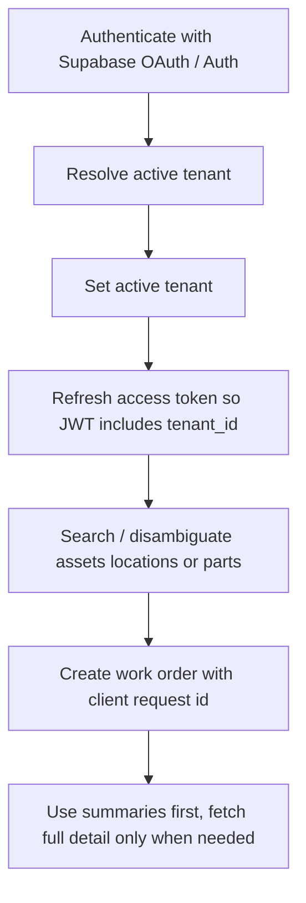

export const metadata = {
  title: 'Building agents and MCP clients',
  description:
    'Recommended OAuth, tenant, search, retry, and error-handling flow for CMMS agents.',
}

export const sections = [
  { title: 'Recommended flow', id: 'recommended-flow' },
  { title: 'Tenant bootstrap', id: 'tenant-bootstrap' },
  { title: 'Search and disambiguation', id: 'search-and-disambiguation' },
  { title: 'Retry-safe writes', id: 'retry-safe-writes' },
  { title: 'Structured errors', id: 'structured-errors' },
  { title: 'Embed search and freshness', id: 'embed-search-and-freshness' },
]

# Building agents and MCP clients

If you are building an AI assistant, workflow agent, or MCP client on top of this CMMS, treat the public API surface the same way you would treat a human-facing SDK contract: explicit tenant flow, explicit search/disambiguation, retry-safe writes, and machine-readable errors. {{ className: 'lead' }}

## Recommended flow

For the common “search, then create work order” automation path, use this order:



Key rules:

- **Do not guess tenant context.**
- **Do not guess entity ids when multiple candidates are plausible.**
- **Always use an idempotency key for automation-driven creates.**
- **Prefer summary reads first** to reduce token usage.

## Tenant bootstrap

Tenant-scoped views and many RPCs depend on **`tenant_id`** being present in the JWT. The safest flow is:

1. authenticate the user
2. resolve which tenant to use
3. call `rpc_set_tenant_context(...)` or `client.setTenant(tenantId)`
4. refresh the session so the next JWT includes `tenant_id`

<CodeGroup title="SDK tenant bootstrap">

```ts
const tenants = await client.tenants.list()

const tenantId = tenants[0]!.id
await client.setTenant(tenantId)

const { data } = await client.supabase.auth.getSession()
if (data.session) {
  await client.supabase.auth.setSession({
    access_token: data.session.access_token,
    refresh_token: data.session.refresh_token,
  })
}
```

</CodeGroup>

For HTTP MCP, the server can refresh in-request when the client sends **`X-Supabase-Refresh-Token`**. Without a refresh, tenant-scoped reads may return empty results because the old JWT still lacks `tenant_id`.

## Search and disambiguation

Use search before writes when the user refers to an asset, part, or location by natural language. The richer search surface returns:

- canonical `entity_id`
- `entity_type`
- `label`
- ranking fields such as `match_type` and `score`
- disambiguation hints such as:
  - `site_name`
  - `location_path`
  - `asset_number`
  - `barcode`
  - `part_number`
  - `supplier_name`
  - `disambiguation_hint`

That lets agents ask a user:

> “Did you mean pump P-101 in Plant A > Utilities, or pump P-101 in Plant B > Chilled Water?”

instead of guessing.

## Retry-safe writes

Programmatic work-order creation supports an optional **client request id**.

Reuse the same id when retrying the *same intended create*. If the first attempt already succeeded, the API returns the original `work_order_id` instead of creating a duplicate.

<CodeGroup title="Retry-safe SDK create">

```ts
const workOrderId = await client.workOrders.create({
  tenantId,
  title: 'Inspect chilled water pump vibration',
  assetId,
  priority: 'high',
  clientRequestId: 'agent-run-2026-03-29-001',
})
```

</CodeGroup>

Use a fresh request id only when the user intends a **different** work order.

## Structured errors

SDK calls throw **`SdkError`** with:

- `message`
- `code`
- `details`
- `hint`

MCP tools preserve the same structure in their JSON error payloads so agents can branch on:

- **tenant context required**
- **permission denied**
- **validation error**
- **retryable / transient** cases

Prefer handling errors by `code` and then using `message/details/hint` for user-facing explanations.

## Embed search and freshness

When **`WORKORDER_SYSTEMS_EMBED_SEARCH_URL`** is configured, MCP exposes text-in similarity tools such as:

- `similar_past_work_orders`
- `semantic_search`

These depend on separately indexed embeddings. Treat them as **assistive grounding**, not as a source of truth for canonical ids:

- use embed search to find similar history
- use entity search / canonical ids for the final write

Index freshness depends on your embedding/indexing pipeline. If a very new work order, asset, or part is not appearing in similarity results yet, fall back to standard list/get/search surfaces.

<div className="not-prose flex flex-wrap gap-3">
  <Button href="/mcp" variant="text" arrow="right">
    <>MCP overview</>
  </Button>
  <Button href="/tenant-context" variant="text" arrow="right">
    <>Tenant context</>
  </Button>
  <Button href="/errors" variant="text" arrow="right">
    <>Errors</>
  </Button>
  <Button href="/work-orders" variant="text" arrow="right">
    <>Work orders</>
  </Button>
</div>
