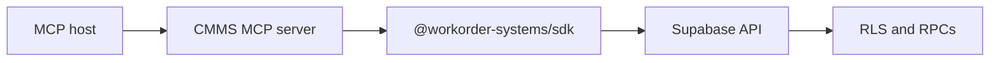

export const metadata = {
  title: 'MCP (Model Context Protocol)',
  description:
    'AI assistants and MCP clients use the same Supabase JWT and SDK-backed tools as your app.',
}

export const sections = [
  { title: 'What it is', id: 'what-it-is' },
  { title: 'Run the server', id: 'run-the-server' },
  { title: 'Clients and OAuth', id: 'clients-and-oauth' },
  { title: 'Tenant context and tools', id: 'tenant-context-and-tools' },
  { title: 'Summary-first tools', id: 'summary-first-tools' },
  { title: 'Bundles and structured errors', id: 'bundles-and-structured-errors' },
  { title: 'Full reference', id: 'full-reference' },
]

# MCP (Model Context Protocol)

The repo ships an **MCP server** (`apps/mcp`) that exposes CMMS operations to **AI assistants** (Cursor, Claude Code, and other MCP hosts). It uses the same **Supabase Auth** session as the SDK: **Bearer JWTs**, **RLS**, and **tenant-scoped RPCs** — not a separate API key per tool call. {{ className: 'lead' }}

<Note>
  Deep setup — Cursor + <code>mcp-remote</code>, Streamable HTTP, RFC 9728 metadata, production URLs — lives in the repo README linked below so it stays in sync with the code.
</Note>

## What it is

- **Transport:** Streamable HTTP at **`/mcp`** (default local base `http://127.0.0.1:3765`).
- **Authorization:** **Supabase** is the OAuth 2.1 authorization server; the consent UI is **`apps/oauth`** in this monorepo.
- **Behavior:** Tools validate inputs and call **`@workorder-systems/sdk`** (same surface as a typed app client).



## Run the server

From the **repository root**, with **`SUPABASE_URL`** and **`SUPABASE_ANON_KEY`** in **`.env.local`** (root or `apps/mcp/.env.local`):

<CodeGroup title="Local MCP (default port 3765)">

```bash
pnpm mcp
```

</CodeGroup>

**Health check:** `GET /health` (no auth) should return JSON with `"ok": true`.

## Clients and OAuth

- **Cursor** typically runs **`mcp-remote`** against the HTTP MCP URL. The browser completes **OAuth**; you **do not** put access or refresh tokens in `.cursor/mcp.json`.
- **Production:** deploy the MCP app behind HTTPS, set a public origin env var so OAuth metadata matches your URL (see README).

Read [Authentication](/authentication) for how sessions work; MCP reuses that model.

## Tenant context and tools

- List tenants, then **set active tenant** so the JWT includes **`tenant_id`** where required (same idea as [Tenant context](/tenant-context)). Some HTTP clients need a **token refresh** after switching tenant.
- **Generic access:** **`sdk_catalog`** lists operations and JSON Schema args; **`sdk_invoke`** runs any SDK operation by id.
- **Shortcuts:** convenience tools (e.g. work order list/get/create) wrap the same RPCs.

The recommended MCP flow is:

1. `resolve_active_tenant`
2. `set_active_tenant`
3. retry with the refreshed JWT if the tool response says tenant context is still missing
4. use summary or search tools before opening full detail

## Summary-first tools

For agents, token efficiency matters. This MCP server exposes lightweight tools for selection and disambiguation before full-row reads:

- `work_orders_list_summary`
- `work_orders_get_summary`
- `assets_list_summary`
- `parts_list_summary`
- `pm_schedules_list_summary`

Use these first when the goal is “pick the right row” rather than “inspect every field”.

## Bundles and structured errors

- `workflow_guide` provides the recommended high-level order of operations.
- `workflow_bundle` returns a curated bundle such as `tenant_bootstrap`, `work_order_intake`, `work_order_lookup`, or `maintenance_lookup`.
- MCP errors preserve structured fields when available:
  - `message`
  - `code`
  - `details`
  - `hint`

For example, missing tenant context returns an explicit guidance payload instead of silently returning an empty list where possible.

For a full agent-builder guide, see [Building agents](/agents).

## Full reference

**[apps/mcp/README.md](https://github.com/workorder-systems/db/blob/main/apps/mcp/README.md)** — Cursor config, `mcp-remote` callback ports, Claude Code HTTP transport, env vars, and troubleshooting.

<div className="not-prose mt-8 flex flex-wrap gap-3">
  <Button href="/quickstart" variant="text" arrow="right">
    <>Quickstart</>
  </Button>
  <Button href="/tenant-context" variant="text" arrow="right">
    <>Tenant context</>
  </Button>
  <Button href="/agents" variant="text" arrow="right">
    <>Building agents</>
  </Button>
</div>
