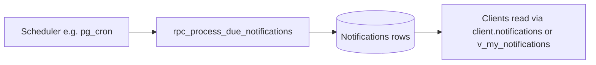

export const metadata = {
  title: 'Notifications',
  description:
    'In-app notifications: list unread items, mark read, and per-event preferences via the SDK or views and RPCs.',
}

export const sections = [
  { title: 'List notifications', id: 'list-notifications' },
  { title: 'Mark as read', id: 'mark-read' },
  { title: 'Preferences', id: 'preferences' },
  { title: 'Advanced: raw PostgREST', id: 'advanced-postgrest' },
  { title: 'Background processing', id: 'background-processing' },
]

# Notifications

Per-user, per-tenant **in-app notifications** (title, body, optional entity link, payload). Use **`client.notifications`** on **`@workorder-systems/sdk`**, or call **`client.supabase`** directly—views and RPCs are typed on the SDK **`Database`** type. Set **tenant context** and refresh the session before tenant-scoped calls, same as other APIs. {{ className: 'lead' }}

<Note>
  **`client.notifications.list()`** reads **`v_my_notifications`** (PostgREST filters, optional `unreadOnly`). **`listForTenant(tenantId)`** uses **`rpc_list_my_notifications`** when you prefer an explicit tenant id argument.
</Note>

## List notifications

<CodeGroup title="client.notifications.list() (preferred)">

```ts
import { createDbClient } from '@workorder-systems/sdk'

const client = createDbClient(
  process.env.SUPABASE_URL!,
  process.env.SUPABASE_ANON_KEY!
)

await client.setTenant(tenantId)
const { data: session } = await client.supabase.auth.getSession()
if (session.session) {
  await client.supabase.auth.setSession({
    access_token: session.session.access_token,
    refresh_token: session.session.refresh_token,
  })
}

const rows = await client.notifications.list({
  unreadOnly: true,
  limit: 50,
})
```

</CodeGroup>

<CodeGroup title="client.notifications.listForTenant(tenantId)">

```ts
const rows = await client.notifications.listForTenant(tenantId, 50)
```

</CodeGroup>

## Mark as read

Pass one or more notification ids returned from the list above.

<CodeGroup title="client.notifications.markRead()">

```ts
await client.notifications.markRead({
  tenantId,
  notificationIds: [notificationId],
})
```

</CodeGroup>

## Preferences

Toggle **in-app** delivery for a given **`event_key`** (string defined by the backend for each notification type). Requires **`notification.preference.manage`** (included on default roles such as member and admin).

<CodeGroup title="client.notifications.upsertPreference()">

```ts
await client.notifications.upsertPreference({
  tenantId,
  eventKey: 'work_order.assigned',
  channelInApp: true,
})
```

</CodeGroup>

## Advanced: raw PostgREST

Use **`client.supabase`** when you need custom filters or to avoid the resource wrapper.

<CodeGroup title="Query v_my_notifications">

```ts
const { data: rows, error } = await client.supabase
  .from('v_my_notifications')
  .select('*')
  .is('read_at', null)
  .order('created_at', { ascending: false })
  .limit(50)
```

</CodeGroup>

<CodeGroup title="rpc_list_my_notifications">

```ts
const { data, error } = await client.supabase.rpc('rpc_list_my_notifications', {
  p_tenant_id: tenantId,
  p_limit: 50,
})
```

</CodeGroup>

## Background processing

**`rpc_process_due_notifications`** is intended for **trusted server** contexts (for example Supabase **pg_cron** or an Edge Function using the **service role**). It is **not** exposed on **`client.notifications`** and must not be called from end-user clients. Your deployment wires when and how due notifications are materialized.


