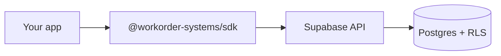
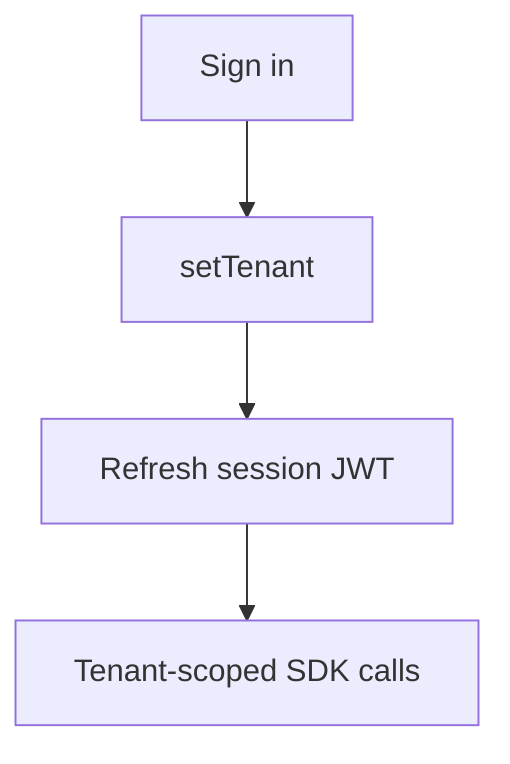

export const metadata = {
  title: 'Quickstart',
  description: 'Set up the SDK, create a client, and make your first requests.',
}

export const sections = [
  { title: 'Install the SDK', id: 'install-sdk' },
  { title: 'How the pieces connect', id: 'how-it-connects' },
  { title: 'Create a client and call the API', id: 'first-request' },
  { title: 'Next steps', id: 'next-steps' },
]

# Quickstart

Install the client, wire in your Supabase URL and anon key, then call a resource. Most flows need **Auth** and **tenant context** for tenant-scoped data. This page shows the minimal path. {{ className: 'lead' }}

<Note>
  Grab the **URL** and **anon key** under [Project Settings → API](https://supabase.com/dashboard). Tenant-scoped lists require a signed-in user and **`client.setTenant(...)`** plus a session refresh. See [Tenant context](/tenant-context).
</Note>

## Install the SDK

<CodeGroup>

```bash
npm install @workorder-systems/sdk @supabase/supabase-js
```

</CodeGroup>

The SDK exposes **resources** (`tenants`, `workOrders`, `assets`, …) and helpers for tenant context on top of a typed **`client.supabase`**.

<div className="not-prose flex flex-wrap gap-3">
  <Button href="/installation" variant="text" arrow="right">
    <>Installation details</>
  </Button>
</div>

## How the pieces connect

Your code talks to **PostgREST** (views + RPCs). **Postgres** and **RLS** enforce tenant safety under the hood.



<Note>
  **Mermaid** is enabled site-wide: use a fenced code block with the <code>mermaid</code> language tag, or the exported <code>Mermaid</code> component with a <code>chart</code> string prop.
</Note>

## Create a client and call the API

**Listing tenants** (after sign-in) does not require tenant context. **Work orders and most domain APIs** do: set tenant and refresh the session first.

<CodeGroup title="Client + list tenants (after auth)">

```ts
import { createDbClient } from '@workorder-systems/sdk'

const client = createDbClient(
  process.env.SUPABASE_URL!,
  process.env.SUPABASE_ANON_KEY!
)

const tenants = await client.tenants.list()
```

</CodeGroup>

<CodeGroup title="Tenant-scoped: sign in, set tenant, list work orders">

```ts
await client.supabase.auth.signInWithPassword({
  email: 'user@example.com',
  password: 'password',
})

await client.setTenant(tenantId)

const { data: session } = await client.supabase.auth.getSession()
if (session.session) {
  await client.supabase.auth.setSession({
    access_token: session.session.access_token,
    refresh_token: session.session.refresh_token,
  })
}

const workOrders = await client.workOrders.list()
```

</CodeGroup>

Tenant-scoped calls need **both** a signed-in user and a JWT that includes **`tenant_id`** after `setTenant` and session refresh:



<div className="not-prose flex flex-wrap gap-3">
  <Button href="/tenant-context" variant="text" arrow="right">
    <>Tenant context</>
  </Button>
  <Button href="/work-orders" variant="text" arrow="right">
    <>Work orders</>
  </Button>
</div>

## Next steps

- [Installation](/installation): peers, edge runtimes, env vars
- [Authentication](/authentication): Supabase Auth and the SDK session
- [Tenant context](/tenant-context): when and how to set **`tenant_id`**
- [Errors](/errors): **`SdkError`** and common codes
