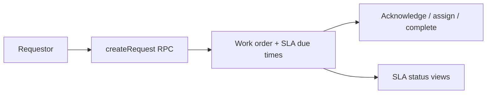

export const metadata = {
  title: 'Request portal and SLA',
  description:
    'End-user work order requests, SLA rules, acknowledgment, and breach status for dispatch dashboards.',
}

export const sections = [
  { title: 'Permissions and roles', id: 'permissions' },
  { title: 'Submit a request (portal)', id: 'portal-submit' },
  { title: 'List my requests', id: 'portal-list' },
  { title: 'SLA rules (admin)', id: 'sla-rules' },
  { title: 'SLA on work orders', id: 'sla-on-work-orders' },
  { title: 'Acknowledge (first response)', id: 'acknowledge' },
  { title: 'SLA status for dashboards', id: 'sla-status' },
]

# Request portal and SLA

These features are what make the platform feel like a **real CMMS** to requestors and coordinators: self-service requests, promised response/resolution times, and clear breach signals. The database stores `requested_by`, computes due times from **per-tenant SLA rules**, and exposes read models for UI and reporting. {{ className: 'lead' }}

Use **`@workorder-systems/sdk`** with tenant context and a refreshed session (JWT with `tenant_id`) like other tenant-scoped APIs.



## Permissions and roles

Key permissions (see migration `cmms_core_suppliers_portal_sla`):

| Permission | Purpose |
|------------|---------|
| `workorder.request.create` | Submit a portal request |
| `workorder.request.view.own` | See `v_my_work_order_requests` |
| `workorder.request.view.any` | See all requests (coordinator) |
| `workorder.acknowledge` | Set `acknowledged_at` for response SLA |
| `tenant.sla.manage` | Create/update SLA rules |

The default **requestor** role is suited to portal users; **admin** / **manager** typically include SLA management and acknowledgment.

## Submit a request (portal)

Creates a work order with **`requested_by`** set to the signed-in user. Location and asset are validated against **ABAC** scopes (`user_can_request_work_order_at_locations`). Rate limited.

<CodeGroup title="client.workOrders.createRequest(params)">

```ts
import { createDbClient } from '@workorder-systems/sdk'

const client = createDbClient(process.env.SUPABASE_URL!, process.env.SUPABASE_ANON_KEY!)

await client.supabase.auth.signInWithPassword({ email, password })
await client.setTenant(tenantId)
const { data: session } = await client.supabase.auth.getSession()
if (session.session) {
  await client.supabase.auth.setSession({
    access_token: session.session.access_token,
    refresh_token: session.session.refresh_token,
  })
}

const workOrderId = await client.workOrders.createRequest({
  tenantId,
  title: 'Leak in restroom',
  description: 'Water pooling near stall 2',
  priority: 'medium',
  maintenanceType: null,
  locationId: 'uuid-of-location', // optional; must be allowed for user
  assetId: null,
  dueDate: null,
})
```

</CodeGroup>

## List my requests

Read-only view of work orders **you** submitted (`v_my_work_order_requests`).

<CodeGroup title="client.workOrders.listMyRequests()">

```ts
const mine = await client.workOrders.listMyRequests()
// MyWorkOrderRequestRow[] — id, title, status, priority, created_at, due_date, location_id, asset_id
```

</CodeGroup>

Staff still use **`client.workOrders.list()`** from `v_work_orders` (RLS varies by role; requestors only see their own rows in the full list).

## SLA rules (admin)

Define **response** and **resolution** intervals per **priority**, with an optional **maintenance type** override. Intervals are Postgres **`interval`** text (e.g. `30 minutes`, `4 hours`, `3 days`). Generic rule: `maintenanceTypeKey` omitted. More specific rule: set `maintenanceTypeKey` to match the work order’s maintenance type.

<CodeGroup title="client.workOrders.upsertSlaRule(params)">

```ts
const ruleId = await client.workOrders.upsertSlaRule({
  tenantId,
  priorityKey: 'high',
  maintenanceTypeKey: null,
  responseInterval: '1 hour',
  resolutionInterval: '1 day',
  isActive: true,
})
// Omit ruleId to create; pass ruleId to update intervals or is_active
```

</CodeGroup>

New and updated work orders get **`sla_response_due_at`** and **`sla_resolution_due_at`** recomputed from active rules (maintenance-specific rule wins, else generic for that priority).

## SLA on work orders

**`v_work_orders`** includes portal and SLA columns, for example:

- `requested_by`, `acknowledged_at`
- `sla_response_due_at`, `sla_resolution_due_at`
- `sla_response_breached_at`, `sla_resolution_breached_at`

Use **`client.workOrders.getById(id)`** or **`list()`** as usual; types come from **`WorkOrderRow`**.

## Acknowledge (first response)

Sets **`acknowledged_at`** once (idempotent), satisfying **response SLA** tracking from the coordinator side.

<CodeGroup title="client.workOrders.acknowledge(params)">

```ts
await client.workOrders.acknowledge({
  tenantId,
  workOrderId,
})
```

</CodeGroup>

## SLA status for dashboards

**`v_work_order_sla_status`** exposes derived **`response_sla_breached`** and **`resolution_sla_breached`** flags for all work orders in the tenant (for dispatch boards and alerts).

<CodeGroup title="List or fetch one">

```ts
const all = await client.workOrders.listSlaStatus()
// WorkOrderSlaStatusRow[]

const one = await client.workOrders.getSlaStatus(workOrderId)
// WorkOrderSlaStatusRow | null
```

</CodeGroup>

<div className="not-prose flex flex-wrap gap-3">
  <Button href="/work-orders" variant="text" arrow="right">
    <>Work orders</>
  </Button>
  <Button href="/notifications" variant="text" arrow="right">
    <>Notifications</>
  </Button>
</div>
