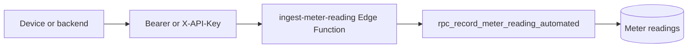

export const metadata = {
  title: 'Tenant API keys',
  description:
    'Create and revoke tenant-scoped API keys for machine access; ingest automated meter readings via the Edge Function.',
}

export const sections = [
  { title: 'What they are (and are not)', id: 'what-they-are' },
  { title: 'SDK: create, list, revoke', id: 'sdk' },
  { title: 'Rate limits', id: 'rate-limits' },
  { title: 'Meter ingest Edge Function', id: 'ingest-edge-function' },
]

# Tenant API keys

Tenant API keys are **long-lived secrets scoped to one tenant**. They are intended for **devices, scripts, or backends** that cannot use a user session — for example, posting **automated meter readings** through the **`ingest-meter-reading`** Edge Function. {{ className: 'lead' }}

## What they are (and are not)

**They are not** a replacement for the Supabase **anon key** or **JWT**: PostgREST and the SDK’s normal calls still expect **Supabase Auth** (or the service role on the server). A tenant API key **does not** let you call arbitrary RPCs as that tenant from the public API.

**They are** opaque strings stored only as a **SHA-256 hash** in the database. When you create a key, the **raw value is returned once** (`wosk_…` prefix); you cannot retrieve it later — only metadata (name, prefix, timestamps).

Managing keys requires the **`tenant.admin`** permission (same pattern as other tenant-scoped admin RPCs).



## SDK: create, list, revoke

Use a **signed-in** Supabase client (user with tenant admin). Pass the tenant UUID explicitly on each call.

<CodeGroup title="client.tenantApiKeys">

```ts
// Create — raw key returned only in this response
const created = await client.tenantApiKeys.create(tenantId, 'Building B IoT gateway')
// { id, key, keyPrefix, name, createdAt }

const keys = await client.tenantApiKeys.list(tenantId)
// Metadata only: id, name, keyPrefix, createdAt, lastUsedAt, expiresAt

await client.tenantApiKeys.revoke(tenantId, keyId)
```

</CodeGroup>

## Rate limits

Server-side rate limits apply **per user per tenant** (rolling windows):

- **Create:** 10 per minute  
- **List:** 30 per minute  
- **Revoke:** 20 per minute  

## Meter ingest Edge Function

The repo includes **`functions/ingest-meter-reading`**. When deployed, it validates the tenant API key with the **service role**, then records a reading with **`reading_type = 'automated'`** via **`rpc_record_meter_reading_automated`**.

**Endpoint (hosted Supabase):** `https://<project-ref>.supabase.co/functions/v1/ingest-meter-reading`

**Headers** (either form):

- `Authorization: Bearer <tenant_api_key>`  
- or `X-API-Key: <tenant_api_key>`

**Body (JSON):**

```json
{
  "meterId": "uuid",
  "readingValue": 123.4,
  "readingDate": "2025-03-22T12:00:00.000Z",
  "notes": "optional"
}
```

**Responses:** `201` with `{ "readingId": "uuid" }` on success; `401` for missing/invalid/expired keys; `4xx` for validation or tenant/meter mismatches. The function needs **`SUPABASE_URL`** and **`SUPABASE_SERVICE_ROLE_KEY`** in its environment (set automatically when deployed in Supabase).

Local testing: see **`apps/supabase/README.md`** and the root script that serves functions (e.g. **`supabase:functions`**).

<div className="not-prose flex flex-wrap gap-3">
  <Button href="/meters" variant="text" arrow="right">
    <>Meters</>
  </Button>
  <Button href="/authentication" variant="text" arrow="right">
    <>Authentication</>
  </Button>
  <Button href="/configuration" variant="text" arrow="right">
    <>Configuration</>
  </Button>
</div>
