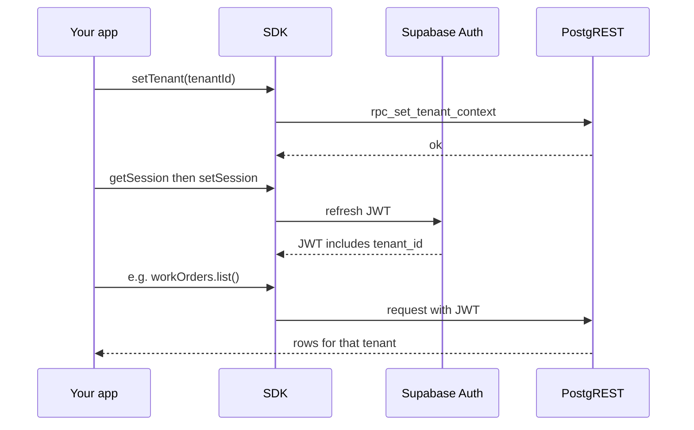

export const metadata = {
  title: 'Tenant context',
  description: 'Set and clear tenant context for tenant-scoped resources.',
}

export const sections = [
  { title: 'Why tenant context?', id: 'why-tenant-context' },
  { title: 'Set tenant context', id: 'set-tenant-context' },
  { title: 'Clear tenant context', id: 'clear-tenant-context' },
  { title: 'Which resources are tenant-scoped?', id: 'which-resources' },
]

# Tenant context

The API is **multi-tenant**. Work orders, assets, locations, and similar resources are scoped to a **current tenant** you choose for the session. {{ className: 'lead' }}

## Why tenant context?

Scoped views and RPCs read **`tenant_id`** from the JWT. Call **`client.setTenant(tenantId)`** (which invokes **`rpc_set_tenant_context`**), then **refresh the session** so the new claim is issued. Without that, many queries return empty results or RPCs may error.



## Set tenant context

Call `setTenant(tenantId)` with a tenant the user is a member of. Then refresh the session so the JWT includes the new context (e.g. fetch the session and set it again).

<CodeGroup title="Set tenant and refresh session">

```ts
const tenantId = 'uuid-of-tenant'

await client.setTenant(tenantId)

// Refresh session so JWT carries tenant_id (required for tenant-scoped views/RPCs)
const { data } = await client.supabase.auth.getSession()
if (data.session) {
  await client.supabase.auth.setSession({
    access_token: data.session.access_token,
    refresh_token: data.session.refresh_token,
  })
}

// Now tenant-scoped calls use this tenant
const workOrders = await client.workOrders.list()
```

</CodeGroup>

Without that refresh, the JWT may still omit **`tenant_id`**, so tenant-scoped calls can fail or return nothing.

## Clear tenant context

When switching tenants or logging out, clear the context first:

```ts
await client.clearTenant()
```

Then set the new tenant and refresh, or sign out with `client.supabase.auth.signOut()`.

## Which resources are tenant-scoped?

- **Not tenant-scoped:** `client.tenants.list()` and `client.tenants.getById(id)`. They return tenants the user is a member of; no tenant context needed.
- **Tenant-scoped:** work orders, assets, locations, departments, meters, plugins, authorization, catalogs, PM, dashboard, audit. Always call `setTenant(tenantId)` and refresh the session before using these.

<div className="not-prose flex flex-wrap gap-3">
  <Button href="/tenants" variant="text" arrow="right">
    <>Tenants API</>
  </Button>
  <Button href="/work-orders" variant="text" arrow="right">
    <>Work orders API</>
  </Button>
</div>
